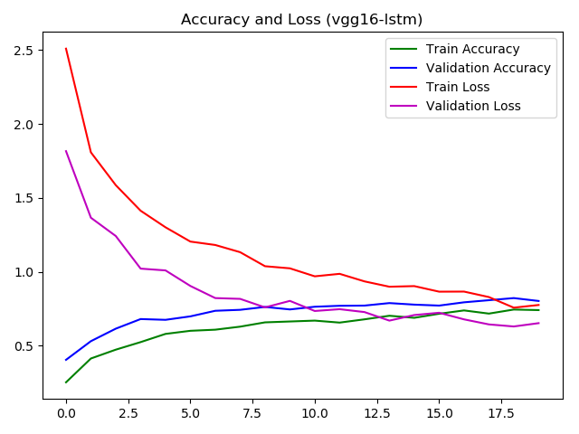
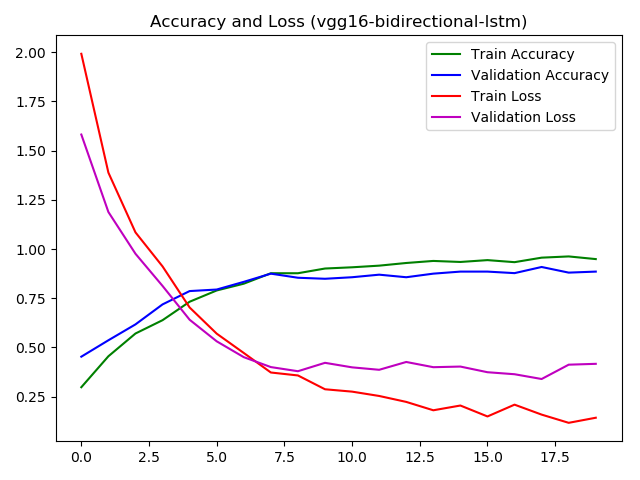
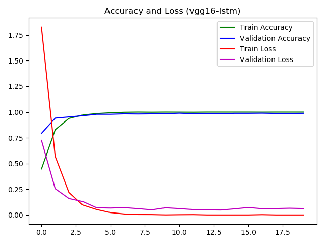
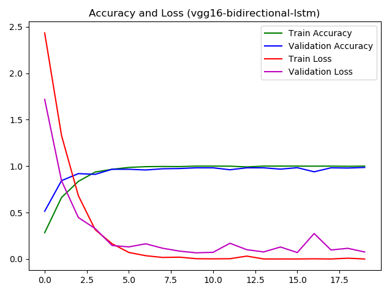
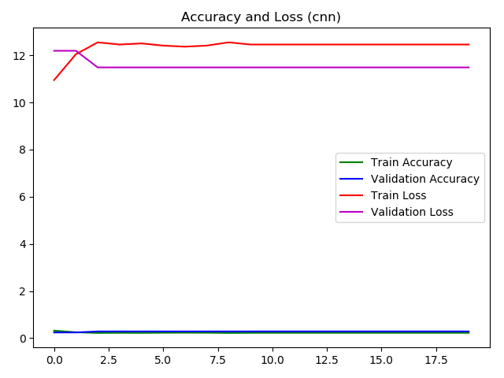

# keras-video-classifier-web-api

Keras implementation of video classifiers serving as web

The training data is [UCF101 - Action Recognition Data Set](http://crcv.ucf.edu/data/UCF101.php). 
Codes are included that will download the UCF101 if they do not exist (due to their large size) in 
the [demo/very_large_data](demo/very_large_data) folder. The download utility codes can be found in
[keras_video_classifier/library/utility/ucf](keras_video_classifier/library/utility/ucf) directory

The video classifiers are defined and implemented in the  [keras_video_classifier/library](keras_video_classifier/library) directory. 

By default the classifiers are trained using video files inside the dataset "UCF-101" located in 
[demo/very_large_data](demo/very_large_data) (the videos files will be downloaded if not exist during
training). However, the classifiers are generic and can be used to train on any other datasets 
(just change the data_set_name parameter in its fit() method to other dataset name instead of UCF-101
will allow it to be trained on other video datasets)

The opencv-python is used to extract frames from the videos.

# Deep Learning Models

The following deep learning models have been implemented and studied:

* VGG16+LSTM: this approach uses VGG16 to extract features from individual frame of the video, the sequence of frame features are then taken into LSTM recurrent networks for classifier.
    * training:  [demo/vgg16_lstm_train.py](demo/vgg16_lstm_train.py) 
    * predictor:  [demo/vgg16_lstm_predict.py](demo/vgg16_lstm_predict.py)
    * training:  [demo/vgg16_lstm_hi_dim_train.py](demo/vgg16_lstm_hi_dim_train.py) (VGG16 top not included) 
    * predictor:  [demo/vgg16_lstm_hi_dim_predict.py](demo/vgg16_lstm_hi_dim_predict.py) (VGG16 top not included)
    
* VGG16+Bidirectional LSTM: this approach uses VGG16 to extract features from individual frame of the video, the sequence of frame features are then taken into bidirectional LSTM recurrent networks for classifier.
    * training:  [demo/vgg16_bidirectional_lstm_train.py](demo/vgg16_bidirectional_lstm_train.py) 
    * predictor:  [demo/vgg16_bidirectional_lstm_predict.py](demo/vgg16_bidirectional_lstm_predict.py)
    * training:  [demo/vgg16_bidirectional_lstm_hi_dim_train.py](demo/vgg16_bidirectional_lstm_hi_dim_train.py) (VGG16 top not included)
    * predictor:  [demo/vgg16_bidirectional_lstm_hi_dim_predict.py](demo/vgg16_bidirectional_lstm_hi_dim_predict.py) (VGG16 top not included)
    
* Convolutional Network: this approach uses stores frames into the "channels" of input of the CNN which then classify the "image" (video frames stacked in the channels)
    * training: demo/cnn_train.py 
    * predictor: demo/cnn_predict.py
    
The trained models are available in the demo/models/UCF-101 folder 
(Weight files of two of the trained model are not included as they are too big to upload, they are 
* demo/models/UCF-101/vgg16-lstm-hi-dim-weights.h5
* demo/models/UCF-101/vgg16-bidirectional-lstm-hi-dim-weights.h5
)

# Usage

### Train Deep Learning model

To train a deep learning model, say VGG16BidirectionalLSTMVideoClassifier, run the following commands:

```bash
pip install -r requirements.txt

cd demo
python vgg16_bidirectional_lstm_train.py 
```

The training code in vgg16_bidirectional_lstm_train.py is quite straightforward and illustrated below:

```python
import numpy as np
from keras import backend as K
from keras_video_classifier.library.recurrent_networks import VGG16BidirectionalLSTMVideoClassifier
from keras_video_classifier.library.utility.plot_utils import plot_and_save_history
from keras_video_classifier.library.utility.ucf.UCF101_loader import load_ucf

K.set_image_dim_ordering('tf')

data_set_name = 'UCF-101'
input_dir_path = './very_large_data' 
output_dir_path = './models/' + data_set_name 
report_dir_path = './reports/' + data_set_name 

np.random.seed(42)

# this line downloads the video files of UCF-101 dataset if they are not available in the very_large_data folder
load_ucf(input_dir_path)

classifier = VGG16BidirectionalLSTMVideoClassifier()

history = classifier.fit(data_dir_path=input_dir_path, model_dir_path=output_dir_path, data_set_name=data_set_name)

plot_and_save_history(history, VGG16BidirectionalLSTMVideoClassifier.model_name,
                      report_dir_path + '/' + VGG16BidirectionalLSTMVideoClassifier.model_name + '-history.png')

```

After the training is completed, the trained models will be saved as cf-v1-*.* in the demo/models.

### Predict Video Class Label

To use the trained deep learning model to predict the class label of a video, you can use the following code:

```python

import numpy as np

from keras_video_classifier.library.recurrent_networks import VGG16BidirectionalLSTMVideoClassifier
from keras_video_classifier.library.utility.ucf.UCF101_loader import load_ucf, scan_ucf_with_labels

vgg16_include_top = True
data_set_name = 'UCF-101'
data_dir_path = './very_large_data'
model_dir_path = './models/' + data_set_name 
config_file_path = VGG16BidirectionalLSTMVideoClassifier.get_config_file_path(model_dir_path,
                                                                              vgg16_include_top=vgg16_include_top)
weight_file_path = VGG16BidirectionalLSTMVideoClassifier.get_weight_file_path(model_dir_path,
                                                                              vgg16_include_top=vgg16_include_top)

np.random.seed(42)

# this line downloads the video files of UCF-101 dataset if they are not available in the very_large_data folder
load_ucf(data_dir_path)

predictor = VGG16BidirectionalLSTMVideoClassifier()
predictor.load_model(config_file_path, weight_file_path)

# scan_ucf returns a dictionary object of (video_file_path, video_class_label) where video_file_path
# is the key and video_class_label is the value
videos = scan_ucf_with_labels(data_dir_path, [label for (label, label_index) in predictor.labels.items()])

video_file_path_list = np.array([file_path for file_path in videos.keys()])
np.random.shuffle(video_file_path_list)

correct_count = 0
count = 0

for video_file_path in video_file_path_list:
    label = videos[video_file_path]
    predicted_label = predictor.predict(video_file_path)
    print('predicted: ' + predicted_label + ' actual: ' + label)
    correct_count = correct_count + 1 if label == predicted_label else correct_count
    count += 1
    accuracy = correct_count / count
    print('accuracy: ', accuracy)
```

Below shows the print out of [demo/vgg16_bidirectional_lstm_predict.py](demo/vgg16_bidirectional_lstm_predict.py) 
towards the end of its execution:

```text
predicted: Biking actual: Biking
accuracy:  0.8593481989708405
Extracting frames from video:  ./very_large_data/UCF-101\Billiards\v_Billiards_g24_c01.avi
predicted: Billiards actual: Billiards
accuracy:  0.8595890410958904
Extracting frames from video:  ./very_large_data/UCF-101\BabyCrawling\v_BabyCrawling_g22_c06.avi
predicted: BabyCrawling actual: BabyCrawling
accuracy:  0.8598290598290599
Extracting frames from video:  ./very_large_data/UCF-101\Bowling\v_Bowling_g13_c01.avi
predicted: Bowling actual: Bowling
accuracy:  0.8600682593856656
Extracting frames from video:  ./very_large_data/UCF-101\BalanceBeam\v_BalanceBeam_g24_c04.avi
predicted: BalanceBeam actual: BalanceBeam
accuracy:  0.8603066439522998
Extracting frames from video:  ./very_large_data/UCF-101\BrushingTeeth\v_BrushingTeeth_g12_c02.avi
predicted: BrushingTeeth actual: BrushingTeeth
accuracy:  0.8605442176870748
Extracting frames from video:  ./very_large_data/UCF-101\BasketballDunk\v_BasketballDunk_g04_c01.avi
predicted: BasketballDunk actual: BasketballDunk
accuracy:  0.8607809847198642
Extracting frames from video:  ./very_large_data/UCF-101\Bowling\v_Bowling_g04_c03.avi
predicted: BenchPress actual: Bowling
accuracy:  0.8593220338983051
Extracting frames from video:  ./very_large_data/UCF-101\BaseballPitch\v_BaseballPitch_g19_c01.avi
predicted: BaseballPitch actual: BaseballPitch
accuracy:  0.8595600676818951
Extracting frames from video:  ./very_large_data/UCF-101\Archery\v_Archery_g18_c03.avi
predicted: Archery actual: Archery
accuracy:  0.8597972972972973
Extracting frames from video:  ./very_large_data/UCF-101\Bowling\v_Bowling_g19_c03.avi
...
```

# Evaluation

20 classes from UCF101 is used to train the video classifier. 20 epochs are set for the training


### Evaluate VGG16+LSTM (top included for VGG16)

Below is the train history for the VGG16+LSTM (top included for VGG16):



The LSTM with VGG16 (top included) feature extractor: (accuracy around 68.9% for training and 55% for validation)

### Evaluate VGG16+Bidirectional LSTM (top included for VGG16):

Below is the train history for the VGG16+Bidirectional LSTM (top included for VGG16):



The bidirectional LSTM with VGG16 (top included) feature extractor: (accuracy around 89% for training and 77% for validation)

### Evaluate VGG16+LSTM (top not included for VGG16)

Below is the train history for the VGG16+LSTM (top not included for VGG16):



The LSTM with VGG16 (top not included)feature extractor: (accuracy around 100% for training and 98.83% for validation)

### Evaluate VGG16+Bidirectional LSTM (top not included for VGG16)

Below is the train history for the VGG16+LSTM (top not included for VGG16):



The LSTM with VGG16 (top not included) feature extractor: (accuracy around 100% for training and 98.57% for validation)


### Evaluate Convolutional Network

Below is the train history for the Convolutional Network:



The Convolutional Network: (accuracy around 22.73% for training and 28.75% for validation)

# Note 

### Configure Keras to run on GPU on Windows

* Step 1: Change tensorflow to tensorflow-gpu in requirements.txt and install tensorflow-gpu
* Step 2: Download and install the [CUDA® Toolkit 9.0](https://developer.nvidia.com/cuda-90-download-archive) (Please note that
currently CUDA® Toolkit 9.1 is not yet supported by tensorflow, therefore you should download CUDA® Toolkit 9.0)
* Step 3: Download and unzip the [cuDNN 7.0.4 for CUDA@ Toolkit 9.0](https://developer.nvidia.com/cudnn) and add the
bin folder of the unzipped directory to the $PATH of your Windows environment 
"# keras-video-classifier" 
